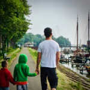

# Jens Bremmekamp

## Senior Software Developer

### About me

My name is Jens, I am a Software Developer out of passion and been doing that
for a good 20 years.

I was born in 1975 in Bonn, Germany, where I still/again reside; I love 
well structured programming, hiking (with friends and/or family), climbing, 
sailing, reading, learning, helping people to learn, computer gaming, computer 
building and probably some other stuff I just forgot about.

Since 2016 I have been working at [Chefkoch](https://www.chefkoch.de), Europe's
biggest cooking website.

### Contact me

* [on Facebook](https://www.facebook.com/nem75)
* [on GitHub](//github.com/nem75)
* [on Stackoverflow](https://stackoverflow.com/users/564183/nem75)
* [on LinkedIn](https://de.linkedin.com/in/jens-bremmekamp-04769012b/de)
* [by e-mail](mailto:jens.bremmekamp@gmail.com)

### CV / Skill Profile

In German: [gibt es hier.](cv_de.md)

